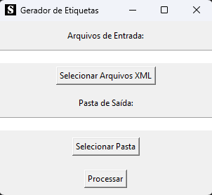

# XML Reader v4.0



## Índice

- [Pré-requisitos](#pré-requisitos)
- [Instalação](#instalação)
- [Utilização](#utilização)
- [Contribuição](#contribuição)
- [Créditos](#créditos)
- [Contato](#contato)

## Pré-requisitos

- Python
- PyInstaller

## Instalação

1. Clone o repositório para seu ambiente local:

```
git clone https://github.com/Wallauerr/xml-reader.git && cd xml-reader
```

2. Instale as dependências:

```
pip install -e ".[dev]"
```

3. Execute o comando para criar um arquivo `executável`:

```
pyinstaller app.spec
```

4. Se você continuar enfrentando erros relacionados ao comando pyinstaller, uma alternativa eficaz é executar o PyInstaller diretamente como um módulo do Python. Para isso, utilize o seguinte comando:

```
python -m PyInstaller app.spec
```

5. Navegue até o novo diretório chamado `dist` e em seguida execute o arquivo .exe que foi criado para rodar o app.

## Utilização

1. Selecione a pasta de entrada onde estão seus arquivos xml.
2. Selecione a pasta de saída onde quer salvar os arquivos convertidos.
3. Clique em `Processar`.

## Contribuição

 Contribuições são sempre bem-vindas! Siga as etapas abaixo para contribuir com este projeto:

1. Dê um fork neste repositório.
2. Instale as dependencias do projeto:

```
pip install .
```
3. Execute o comando para visualizar o app em tempo real de desenvolvimento:

```
python src\dev.py
```

4. Crie uma nova branch com sua feature/correção:

```
git checkout -b nome-da-sua-branch
```

5. Realize as alterações e commits:

```
git commit -m "tipoDeModificação: Descrição das suas alterações"
```

6. Envie as alterações para o fork do repositório:

```
git push origin nome-da-sua-branch
```

7. Abra um Pull Request neste repositório (original).

## Créditos

- [Python](https://www.python.org/)
- [PyInstaller](https://pyinstaller.org/en/stable/)
- [Chardet](https://pypi.org/project/chardet/)
- [ReportLab](https://docs.reportlab.com/)

## Contato

Se tiver alguma dúvida ou sugestão, você pode entrar em contato comigo por meio do email: wallauer@protonmail.com
